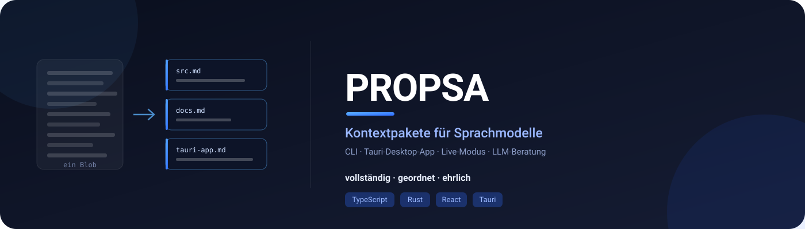

# PROPSA

**PROPSA** turns a project folder into an **LLM-ready context package**: several
files instead of one giant blob, split by domain, every file complete.

[Deutsche Fassung](README.md)

[](LICENSE)
[](package.json)
[](#desktop-app)

---

## Why not just `cat`?

Because a model loses the thread on a single 12 MB dump — and with a truncated
export it will not even notice that something is missing. PROPSA writes

- **complete** – every file in full, never cut off,
- **ordered** – one file per domain so a model can read selectively,
- **honest** – limits are guardrails: they abort the run (exit code 2) instead
  of writing an incomplete package. Fail loud, never truncate silent.

## What you get

| File | Content |
|---|---|
| `Zusammenfassung.md` | Entry point: size, domains, languages, largest files |
| `Architektur.md` | Directory tree and per-file overview |
| `Dokumentation.md` | every Markdown file in full |
| `Quellen/<domain>.md` | full source of that domain |
| `kontext.json` | the same data, machine-readable (schema version 2) |

A **domain is the top-level folder** of a relative path: `tauri-app/src-tauri/src/scan.rs`
lands in `Quellen/tauri-app.md`, `README.md` in `Quellen/wurzel.md`.
Details (German): [docs/wiki/Kontextpaket.md](docs/wiki/Kontextpaket.md).

## CLI

```bash
npm install

# Scan a project folder, write the package to ./propsa-kontext/
npm start /path/to/project

# Custom target folder and extra excludes
npm start ~/code/my-project -o paket/ -e "*.min.js,*.log"

# Everything in a single file instead of a package
npm start ~/code/my-project --einzeln context.md
npm start ~/code/my-project --einzeln context.json
```

| Flag | Meaning |
|------|---------|
| `-o, --output <folder>` | Target folder of the package (default `propsa-kontext`) |
| `--einzeln <file>` | Write a single `.md` or `.json` file instead |
| `-e, --exclude <patterns>` | Additional glob patterns to exclude (comma-separated) |
| `-i, --include <patterns>` | Include only these patterns (empty = everything) |
| `-m, --max-files <n>` | Guardrail: hard file limit (aborts with exit code 2) |
| `-l, --max-lines <n>` | Guardrail: hard line limit (aborts with exit code 2) |
| `--no-limits` | Disable all guardrails |
| `--entrypoint <file>` | Slice: entry file plus its local import chain |
| `--depth <n>` | Slice: only files up to this folder depth |
| `--top-files <n>` | Slice: only the n largest files by lines |
| `--delta` | Report the delta against the last run (`~/.propsa/history/`) |
| `--cache` | Reuse the cached result when the tree is unchanged (`~/.propsa/cache/`, German docs) |

The default is a **complete scan**: no limits. Only dependencies, version
control, build artifacts and caches are excluded. `node_modules`,
`__pycache__`, `.venv`, `target` and `dist` are never entered — even with an
empty exclude field.

The former compact mode (`-c`) has been removed. Instead of arbitrary caps
(≤ 500 lines, ≤ 50 files) you pick a target: `--entrypoint` follows the import
chain, `--depth` caps the depth, `--top-files` takes the largest files.

With `--delta` (CLI) or the “Report changes since last run” checkbox (app)
PROPSA reports the changes since the last run: The history lives centrally
in the user directory (`~/.propsa/history/<identity>.jsonl`); nothing is left
behind in the scanned project. The project is identified via the root commit
hash (`git rev-list --max-parents=0 HEAD`) — stable across branches, paths
and remote URLs; without git the identity falls back to the path. Install
and remove:

```bash
npm run installieren    # build + set up central storage ~/.propsa
npm run deinstallieren  # remove ~/.propsa (with confirmation)
```

`~/.propsa` holds everything PROPSA keeps between runs — except the output:
context packages and `--einzeln` files go where they are requested.

## Desktop app

Tauri v2 with a Rust backend and a React frontend and its own custom title bar
(`decorations: false`): pick a folder, set guardrail limits, review the table,
choose a target folder, write the package. When a limit is hit the app shows
an error message — never a truncated result.

```bash
cd tauri-app
npm install
npm run tauri dev     # development
npm run tauri build   # installers (Windows: MSI and NSIS setup)
```

Requirements: Node.js 18+, Rust 1.70+ and, on Windows, the **C++ build tools**
(Visual Studio Build Tools or Community with “Desktop development with C++”).
Build pitfalls are documented in [docs/wiki/Entwicklung.md](docs/wiki/Entwicklung.md) (German).

## Both surfaces agree

CLI and app share the **contract**, not the code: the same folder with the same
options produces the same files with the same counters and contents. The scanner
collects all candidates, sorts them and reads them afterwards — so limits do not
depend on filesystem order and always hit the same files.

```bash
npm run pruefen   # project rules: line limit, versions, names, catalogs, links
```

## Not in this version

So nobody hunts for features that do not exist: no GitHub URL input, no CI
workflows and no release tags. PROPSA works on the filesystem only.

## License

MIT – see [LICENSE](LICENSE).

## Author

[@vannon091118](https://github.com/vannon091118)
