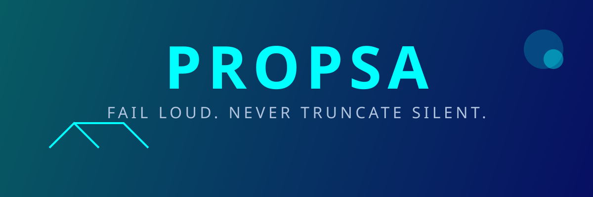

# PROPSA

**PROPSA** (Parser für Repomix Organisiert Prompt-Systeme für Analysen) macht aus
einem Projektordner ein **Kontextpaket für Sprachmodelle**: mehrere Dateien statt
eines Riesenblobs, aufgeteilt nach Domänen, jeweils mit vollständigem Inhalt.

[](LICENSE)
[](package.json)
[](#desktop-app)

---

## Warum nicht einfach `cat`?

Weil ein Modell bei einem einzigen 12-MB-Dump den Zusammenhang verliert. Und
weil eine still gekürzte Ausgabe gar nicht merken lässt, dass etwas fehlt.
PROPSA folgt deshalb einem Prinzip: **Fail Loud, Never Truncate Silent.**

- **vollständig** – jede Datei mit ganzem Inhalt, nie abgeschnitten,
- **geordnet** – eine Datei je Domäne, damit ein Modell gezielt lesen kann,
- **ehrlich** – Limits sind Guardrails: Sie brechen ab (Exit-Code 2), statt
  ein unvollständiges Paket zu schreiben.

## Was drin ist

| Datei im Paket | Inhalt |
|---|---|
| `Zusammenfassung.md` | Einstieg: Umfang, Domänen, Sprachen, größte Dateien |
| `Architektur.md` | Verzeichnisbaum und Dateiübersicht je Domäne |
| `Kritik.md` | Struktur-Befunde: Godfiles, Logikmischung, Artefakte |
| `Dokumentation.md` | alle Markdown-Dateien im Volltext |
| `Quellen/<Domäne>.md` | vollständiger Code der Domäne |
| `kontext.json` | dieselben Daten maschinenlesbar (Schema-Version 2) |

Eine Domäne ist der **oberste Ordner** eines relativen Pfads: `tauri-app/src-tauri/src/scan.rs`
landet in `Quellen/tauri-app.md`, `README.md` in `Quellen/wurzel.md`.
Details: [docs/wiki/Kontextpaket.md](docs/wiki/Kontextpaket.md).

## CLI

```bash
npm install

# Projektordner scannen, Paket nach ./propsa-kontext/ schreiben
npm start /pfad/zu/meinem-projekt

# Eigener Zielordner, zusätzliche Ausschlüsse
npm start ~/Code/mein-projekt -o paket/ -e "*.min.js,*.log"

# Alles in eine einzige Datei statt in ein Paket
npm start ~/Code/mein-projekt --einzeln kontext.md
npm start ~/Code/mein-projekt --einzeln kontext.json
```

| Flag | Bedeutung |
|------|-----------|
| `-o, --output <ordner>` | Zielordner des Pakets (Standard: `propsa-kontext`) |
| `--einzeln <datei>` | Statt des Pakets eine einzelne Datei (`.md` oder `.json`) |
| `-e, --exclude <muster>` | Weitere Glob-Muster zum Ausschließen (Komma-getrennt) |
| `-i, --include <muster>` | Nur diese Muster einbeziehen (leer = alles) |
| `-m, --max-files <n>` | Guardrail: hartes Dateilimit (Abbruch mit Exit-Code 2) |
| `-l, --max-lines <n>` | Guardrail: hartes Zeilenlimit (Abbruch mit Exit-Code 2) |
| `--no-limits` | Alle Guardrails abschalten |
| `--entrypoint <datei>` | Slice: Einstiegsdatei plus lokale Import-Kette |
| `--depth <n>` | Slice: nur Dateien bis zu dieser Ordnertiefe |
| `--top-files <n>` | Slice: nur die n größten Dateien nach Zeilen |
| `--delta` | Delta zum letzten Lauf melden (`~/.propsa/history/`) |

Standard ist ein **vollständiger Scan**: kein Limit. Die Vorgabe schließt nur
Abhängigkeiten, Versionsverwaltung, Build-Artefakte und Caches aus.
`node_modules`, `__pycache__`, `.venv`, `target` und `dist` werden nie betreten
– auch dann nicht, wenn das Ausschlussfeld leer ist.

Projektspezifische, versionierbare Ausschlüsse gehören in eine
**`.propsaignore`** im Projekt-Root (Glob-Muster je Zeile, `!muster` hebt
einen Standard-Ausschluss auf). Details: [docs/wiki/CLI-Usage.md](docs/wiki/CLI-Usage.md).

Mit `--delta` (CLI) bzw. der Checkbox „Änderungen zum letzten Lauf melden“
(App) meldet PROPSA die Änderungen zum letzten Lauf: Die History wohnt
zentral im Benutzerverzeichnis (`~/.propsa/history/<identitaet>.jsonl`),
im gescannten Projekt bleibt nichts zurück. Identifiziert wird das Projekt
über den Root-Commit-Hash (`git rev-list --max-parents=0 HEAD`) – stabil
über Branches, Pfade und Remote-URLs; ohne Git fällt die Identität auf den
Pfad zurück. Installieren und entfernen:

```bash
npm run installieren    # Build + zentrale Ablage ~/.propsa einrichten
npm run deinstallieren  # ~/.propsa entfernen (mit Bestätigung)
```

**Auto-Update:** `npm start -- update --nur-pruefen` prüft gegen
`origin/main`, `npm start -- update` übernimmt neue Commits per
Fast-Forward und installiert neu; `--force-stash` stasht lokale
Änderungen vorab und holt sie zurück. Die App zeigt in der Kopfzeile
denselben Check und einen Update-Button. Releases entstehen automatisch:
Ein Push eines `v*`-Tags löst die GitHub-Action aus (prüfen, bauen,
Release mit Artefakten für Windows/Linux/macOS).

`~/.propsa` nimmt alles auf, was PROPSA zwischen den Läufen behält – außer
dem Output: Kontextpakete und `--einzeln`-Dateien landen dort, wo sie
angefordert werden.

Der frühere Kompaktmodus (`-c`) ist entfernt. Statt arbiträrer Grenzen
(≤ 500 Zeilen, ≤ 50 Dateien) wählt man ein Ziel: `--entrypoint` folgt der
Import-Kette, `--depth` begrenzt die Tiefe, `--top-files` nimmt die größten
Dateien. Details: [docs/wiki/CLI-Usage.md](docs/wiki/CLI-Usage.md).

## Desktop-App

Tauri v2, Rust-Backend und React-Frontend mit eigener Titelzeile
(`decorations: false`): Ordner wählen, Guardrail-Limits setzen,
Ergebnis-Tabelle ansehen, Zielordner wählen, Paket schreiben. Die App
verfolgt die Entwicklung eines Projekts über die Zeit und visualisiert dies
in einem historischen Metrik-Graph (Zeilen- und Dateianzahl). Wird ein Limit
erreicht, zeigt die App eine Fehlermeldung – niemals ein beschnittenes
Ergebnis.

```bash
cd tauri-app
npm install
npm run tauri dev     # Entwicklung
npm run tauri build   # Installer bauen (Windows: MSI und NSIS-Setup)
```

Voraussetzungen: Node.js 18+, Rust 1.70+ und auf Windows die **C++ Build Tools**
(Visual Studio Build Tools oder Visual Studio Community mit „Desktopentwicklung
mit C++“). Stolperfallen beim Bauen stehen in [docs/wiki/Entwicklung.md](docs/wiki/Entwicklung.md).

## Beide Oberflächen liefern dasselbe

CLI und App teilen den **Vertrag** – und seit `@propsa/core` auch den
typeScript-Kern: Sprach-Erkennung, Filterkatalog, Domänen-Regel und das
Export-Schema leben einmal in `packages/core/src/` und werden von der CLI
direkt importiert. Das Rust-Backend setzt dieselben Regeln nach und wird per
`npm run pruefen` mit dem Kern verglichen. Der
Scanner sammelt erst alle Kandidaten, sortiert sie und liest sie dann – dadurch
hängt die Auswahl nicht von der Reihenfolge des Dateisystems ab und ein
Guardrail trifft immer dieselben Dateien.

Geprüft wird das:

```bash
npm run pruefen   # Regeln des Projekts: LOC-Grenze, Versionen, Namen, Kataloge, Links
```

## Projekt-Struktur

```text
.
├── src/                CLI (TypeScript), Einstieg: src/propsa.ts
├── packages/core/      Geteilter Kern @propsa/core (Typen, Regeln, Schema)
├── tauri-app/          Desktop-App (React-Frontend, Rust-Backend)
├── assets/             Banner und Logo
├── INSTALL.md          kanonische Installationsanleitung
├── scripts/            pruefen.mjs – Konsistenzprüfung
├── docs/wiki/               Verträge und Anleitungen
├── ARCHITECTURE.md     Module und Datenfluss
└── LICENSE             MIT
```

## Was diese Version nicht kann

Damit niemand nach Funktionen sucht, die es nicht gibt: **kein**
GitHub-URL-Import und **keine** CI-Workflows für externe Projekte. PROPSA arbeitet ausschließlich auf
dem lokalen Dateisystem.

## Installation

Die kanonische Installationsanleitung steht in [INSTALL.md](INSTALL.md);
sie ist die einzige verbindliche Quelle für Installations-Schritte.

## Lizenz

MIT – siehe [LICENSE](LICENSE).

## Autor

[@vannon091118](https://github.com/vannon091118)
meine lokale notiz
